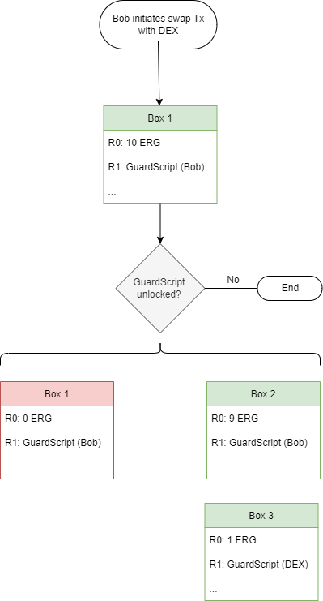
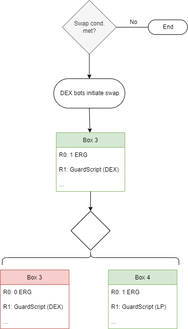
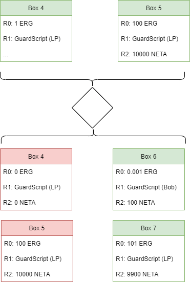

# ErgoScript Course
## Homework 1: Recap of Multi-Stage Transactions and Boxes

### Goals and Purpose
Swap tokens on a DEX. In this example, we will use swapping 1 ERG for 100 NETA. 

### Parties Involved
Individual (Bob) initiating the token swap and the DEX. 

### Overview of Transactions
1. Stage`1 - Bob initiates the swap transaction and signs the tx to send 1 ERG to the DEX smart contract. 
2. Stage 2 - DEX bots initiate swap, sending Bob's ERG to liquidity pool.
3. Stage 3 - DEX bots initiate transaction sending Bob his NETA.

### Details of Stage 1 - 
This transaction starts with Bob's Box 1, which is holding his ERG and outputs two new unspent boxes. Box 2 which is his unspent balance after sending 1 ERG, and Box 3 which is associated with the DEX's validator. Box 3 holds Bob's funds until the swap initiates. 

All boxes used in this stage use the following registers:
- R0 contains the monetary value stored in the box (amount of ERG). 
- R1 contains the GuardScript. 

When Bob signs the tx in his wallet to initiate the swap, the Box 1 GuardScript checks that Bob's private key unlocks the contents. If true, funds are transferred out of Bob's Box 1, making it spent. 1 ERG goes to a new unspent box (Box 2) under the DEX's smart contract and 9 ERG go to a new unspent box (Box 3) under Bob's public key.

Notice in the output, that Bob's Box 1 is now illustrated as red (for spent) and has a balance of 0 ERG. This box now will exist on the blockchain forever as a record of transaction and can longer be interacted with. 

### Details of Stage 2
Stages 2 and 3 are related. In Stage 2, if the logic of the DEX bots determine conditions are met for a swap, Bob's 1 ERG is sent to the liquidity pool. 

The transaction takes Box 3 (holding Bob's funds for swap)  as input and outputs Box 4, which is a new unspent box under the liquidity pool validator for the ERG/NETA trading pair. 

### Details of Stage 3
In Stage 3, Bob's NETA is sent to him. We have Box 4 and Box 5 as inputs. Both boxes are under the liquidity pool validator. 

As output, we have Box 6, which is a new unspent box containing Bob's 100 NETA plus 0.001 ERG. This 0.001 is necessary because it is the minimum value in ERG that an unspent box must contain on the Ergo network.

In this stage, notice we are using the R2 register, which is the register for holding native assets. 

Box 7 is the new unspent box for the liquidity pool. It now contains 101 ERG and 9900 NETA. 

The multi-stage transaction is now complete. 

